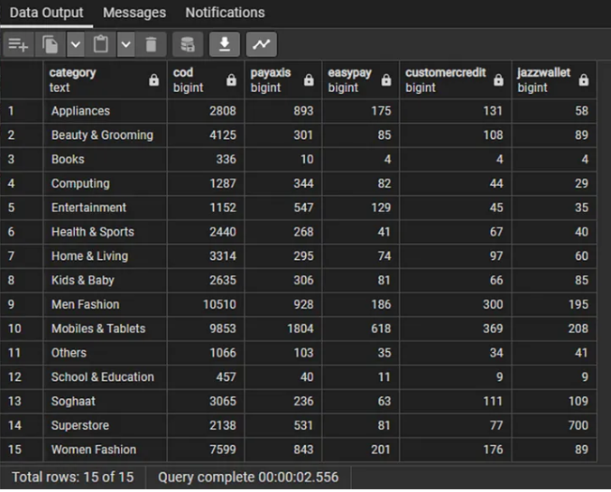

# Analyzing Data with SQL (Structured Query Language) — A Case from an E-Commerce Company

## Introduction
The case study is part#1 of the My Skill Data Analysis Bootcamp Case Project. By examining real-world scenarios, we aim to showcase how SQL empowers businesses to uncover insights, drive informed decision-making, and answering business questions. in this case, an E-Commerce company has been collecting data from its customer during the last 2 years of its operation. The collected data is used to help the management and operation for analyzing and answering some questions they face in their daily business operation. The questions are as follows:

1. Of all the paid transaction took place during 2021, in what month did the maximum total transaction happen?
2. Of all the paid transaction took place during 2021, in what month did the total customer, total order, and the total quantity number of product reach their maximum values?
3. Of all the paid transactions that took place during the 2022, what category of product that drove the maximum value of transaction?
4. By comparing the paid transaction value of each product category between year 2021 and 2022, what are the product categories that experienced improvement, and what are the product categories that experienced decrement of their corresponding transaction values during the period of 2021 and 2022?
5. Display the top 10 sku_name (along with its corresponding category) based on the paid transaction value during the 2022. as well as the total number of customer, total_order, and total quantity!
6. Display the top 5 of the mostly used payment method in 2022 for all paid transactions!
7. Sort the following 5 products based on their corresponding paid transaction value: (Samsung, Apple, Sony, Huawei, and Lenovo)!
8. As per question no 3, provided that the profit is determined by the following formula (profit = after_discount — (cogs x ordered quantity), make a profit comparison between year 2021 and 2022 for each paid product category prior to displaying the percentage (%) of the profit disparity between 2021 and 2022!
9. Provided the result in no 8, display the top 5 of SKU with the highest contribution in year 2022, based on the product category with the highest profit grow between 2021 and 2022!
10. Display the number of unique order that use the top 5 payment methods (from no 6) based on the product category in year 2022!

## Datasets
There are 4 datasets used in analyzing and answering the above questions, mainly the order_detail, sku_detail, customer_detail, and payment_detail datasets. They are modified data and were retrieved from an e-commerce company system which enables it to collect the transactions from their customers making the purchases for the last 2 years (2021 and 2022). Source: [https://www.kaggle.com/datasets/zusmani/pakistans-largest-ecommerce-dataset](https://www.kaggle.com/datasets/zusmani/pakistans-largest-ecommerce-dataset)

1. The order_detail table consists of 287,249 rows and 13 columns
2. The customer_detail table consists of 58,013 rows and 2 columns
3. The payment_detail table consists of 16 rows and 2 columns
4. The sku_detail table consists of 36,554 rows and 5 columns

All the four tables are correlated by the following fields: id and sku_id, payment_id and id, as well as customer_id and id. This implies that the database form a realtional database among others.

## Analyzing the data and Answering the questions

1. Based on the query result, the total transaction (being paid) reaches its maximum during the November of 2021 (around 4.78 Billions).
2. Based on the query result, we can conclude that the total unique customer, total_unique_order, and total_qty_order reached their maximums (13885, 22414, and 47385 respectively) in the November.
3. Based on the query result, we can conclude that there are 15 product categories that drove the sales volume. Among of them, the Mobile & Tablets was in the first place that drove the maximum value of transaction in the year of 2022 with around 8.55 Billions of sales volume.
4. Based on the Query result, it can be inferred that of all the 15 product categories, there 4 product categories that experienced decrement, i.e.: Men Fashion, Books, Soghaat, and Others. The rest of the categories experienced increment in their sales value, i.e.: Mobiles and Tablets, Women Fashion, Entertainment, Appliances, Superstore, Computing, Kids & Baby, Beauty & Grooming, health & Sports, Home & Living, as well as School & Education.
5. The above query created the top 10 table result as depicted in the query result.
6. Based on the query result, we can conclude that cod, Payaxis, Easypay, customercredit, and jazzwallet are in the top 5 payment methods used by customer with theirs corresponding total number of order 42609, 5341, 1443, 1378, and 1368, respectively.
7. Based on the query result, Samsung is in the first place of brands with the highest transaction value of around 3.75B, followed by Apple in the second place with around 1.76B. The other 3 brands are Huawei, Lenovo, and Sonny with their transaction value of 1.01B, 393.55M, and 190.1M respectively.
8. Based on the query result, the product sold from the Women Fashion category yields the highest profit growth with around 1.67% YoY, followed by Superstore in the second place with around 1.46% growth YoY, and Computing with 0.43% YoY in the third place. The negative growth (decrement) came from Kids & Baby, Men Fashion, Others, Soghaat, and Books, where Books reside on the bottom with -0.56% growth.
9. Based on the query result, the top 5 sku_name with the highest contribution in year 2022 are Sanasafinaz_SS-3A, Sanasafinaz_SS-9B, Sanasafinaz_SS-13A, Sanasafinaz_SS-5B, and Sanasafinaz_SS-10A with total profit of around 3.49M, 3.15M, 3.01M, 2.9M, and 2.87M respectively.
10. Based on the query result, there are 15 unique order of product categories that utilized the top 5 payment method (based on previous question No 6). The most unique order came from the Appliances product category, while the least unique order came from the Women Fashion product category.

## Conclusion
Based on the case explained, we can conclude that SQL is essential in managing, manipulating and analyzing large datasets. From the analysis being conducted, SQL can provide crucial insights and help make a data-driven decision for company that adopts its technologies.

## References
1. PostgreSQL Documentation: [https://www.postgresql.org/docs/](https://www.postgresql.org/docs/), accessed before June 30, 2023.
2. The Complete SQL Bootcamp: Go from Zero to Hero by Jose Portilla: [https://www.udemy.com/course/the-complete-sql-bootcamp/](https://www.udemy.com/course/the-complete-sql-bootcamp/)
3. Fullstack Intensive Bootcamp for Data Analyst by MySkill.id (SQL Part 1–5)
4. Pakistani E-Commerce Datasets: [https://www.kaggle.com/datasets/zusmani/pakistans-largest-ecommerce-dataset](https://www.kaggle.com/datasets/zusmani/pakistans-largest-ecommerce-dataset)

## Acknowledgement
Azka Nur Afifah, Wijaya Putra, Rizky Teguh Kurniawan, Achmad Nafila Rozie, and team from [My Skill.id](https://myskill.id)
